# DARAK

<p align="center">
  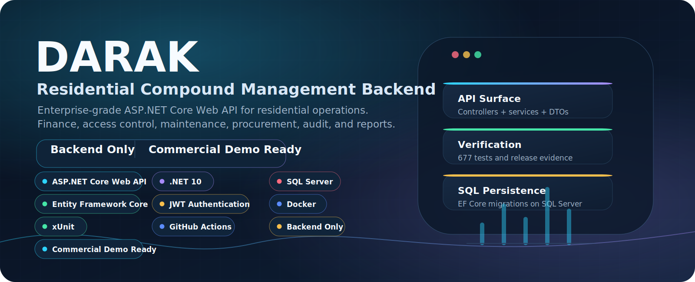
</p>

<p align="center">
  <strong>Residential Compound Management Backend</strong><br>
  Backend-only ASP.NET Core Web API for compounds, residents, billing, payments, visitors, guards, maintenance, procurement, documents, audit, reporting, and notification workflows.
</p>

<p align="center">
  <a href="#technology-stack">Technology Stack</a> |
  <a href="#project-overview">Project Overview</a> |
  <a href="#architecture-overview">Architecture</a> |
  <a href="#business-modules">Business Modules</a> |
  <a href="#testing--quality">Testing</a> |
  <a href="#getting-started">Getting Started</a>
</p>

## Project Introduction

DARAK is a commercial-demo backend for residential compound operations. It is built as an API-first ASP.NET Core platform with scoped access boundaries, broad domain coverage, SQL Server persistence, Docker support, Swagger exploration, GitHub Actions CI, and a recorded 677-test verification snapshot.

This repository is intentionally backend only. It does not include admin, resident, guard, or mobile clients, and it should be evaluated as a professional backend architecture, not as a complete hosted SaaS product.

| Signal | Status |
|---|---|
| Backend scope | ASP.NET Core Web API |
| Runtime | .NET 10 |
| Persistence | SQL Server with Entity Framework Core |
| Authentication | JWT authentication and refresh-token workflows |
| Authorization | Role-based boundaries and compound scoping |
| Quality | 677 automated tests recorded as passed |
| Delivery | Docker Compose, Swagger, GitHub Actions, release evidence docs |
| Positioning | Backend-only commercial demo ready |

## Technology Stack

<p align="center">
  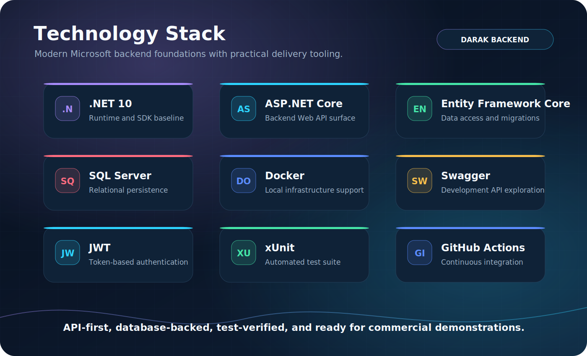
</p>

DARAK uses a Microsoft backend stack centered on ASP.NET Core, Entity Framework Core, SQL Server, and xUnit. Docker and GitHub Actions are included for local infrastructure and CI-oriented release hygiene, while Swagger keeps the API surface explorable during development.

## Project Overview

<p align="center">
  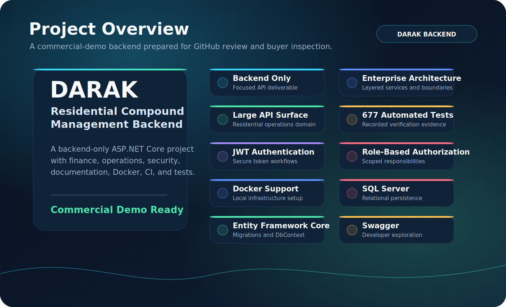
</p>

DARAK is designed to look and behave like a serious enterprise backend:

- Backend-only API surface with a large residential compound domain.
- Layered architecture across controllers, services, EF Core, and SQL Server.
- JWT authentication, refresh tokens, role-based authorization, and compound scoping.
- Finance, visitor access, maintenance, procurement, documents, reports, notifications, audit, and demo seed data.
- Docker support, Swagger, GitHub Actions, evidence docs, and 677 automated tests.

## Architecture Overview

<p align="center">
  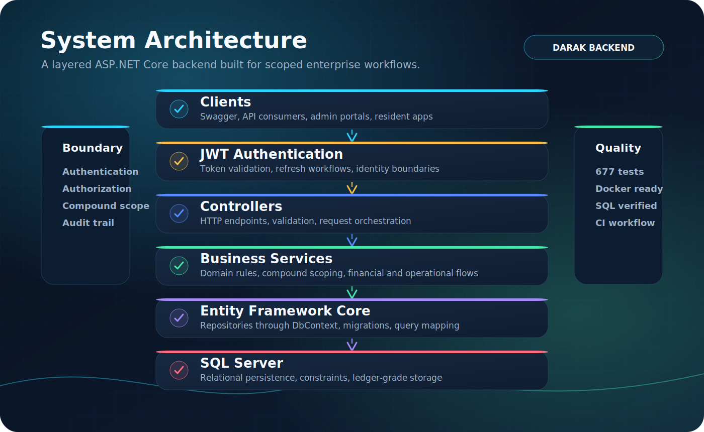
</p>

Core request flow:

```text
Clients
-> JWT Authentication
-> Controllers
-> Business Services
-> Entity Framework Core
-> SQL Server
```

The API keeps HTTP orchestration, domain behavior, authorization boundaries, and database persistence separated so the repository reads as a maintainable backend rather than a CRUD-only sample.

## Business Modules

<p align="center">
  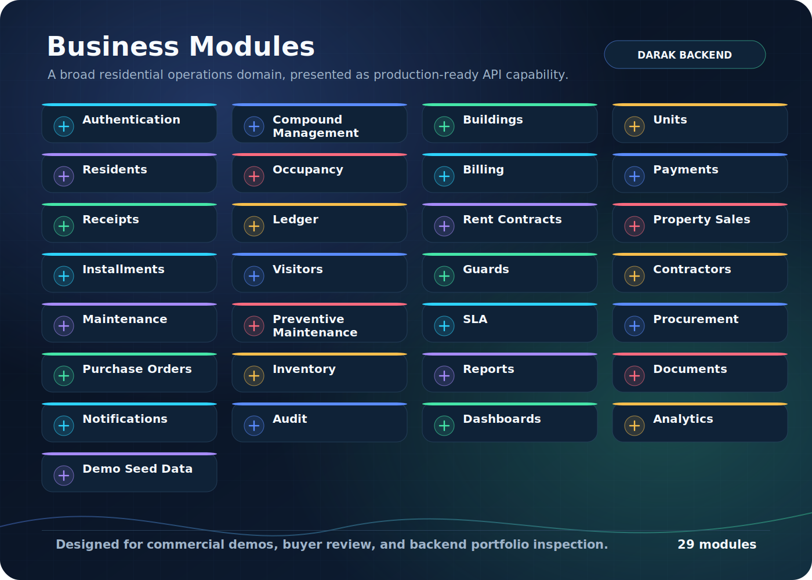
</p>

Major modules include authentication, compound management, buildings, units, residents, occupancy, billing, payments, receipts, ledger, rent contracts, property sales, installments, visitors, guards, contractors, maintenance, preventive maintenance, SLA, procurement, purchase orders, inventory, reports, documents, notifications, audit, dashboards, analytics, and demo seed data.

## Financial Workflow

<p align="center">
  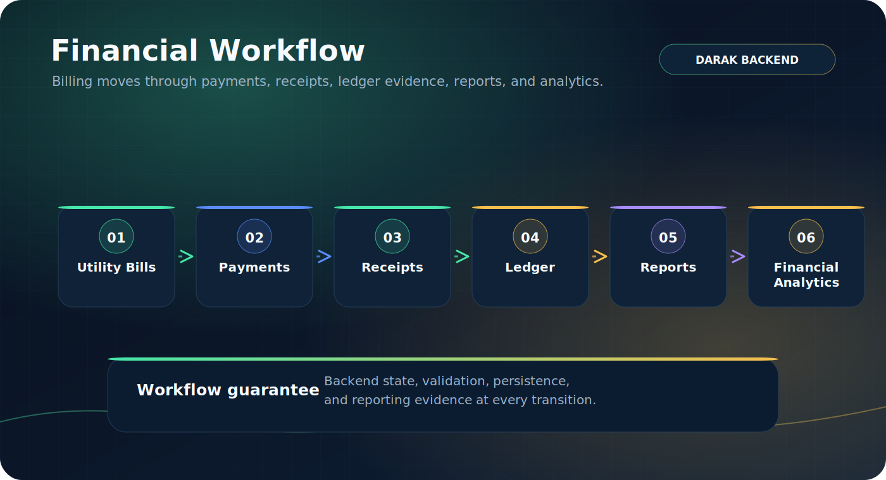
</p>

```text
Utility Bills -> Payments -> Receipts -> Ledger -> Reports -> Financial Analytics
```

The financial model includes billing foundations, payment records, receipts, ledger entries, rent and sale installment workflows, disputes, collections, and reporting surfaces.

## Access Control Workflow

<p align="center">
  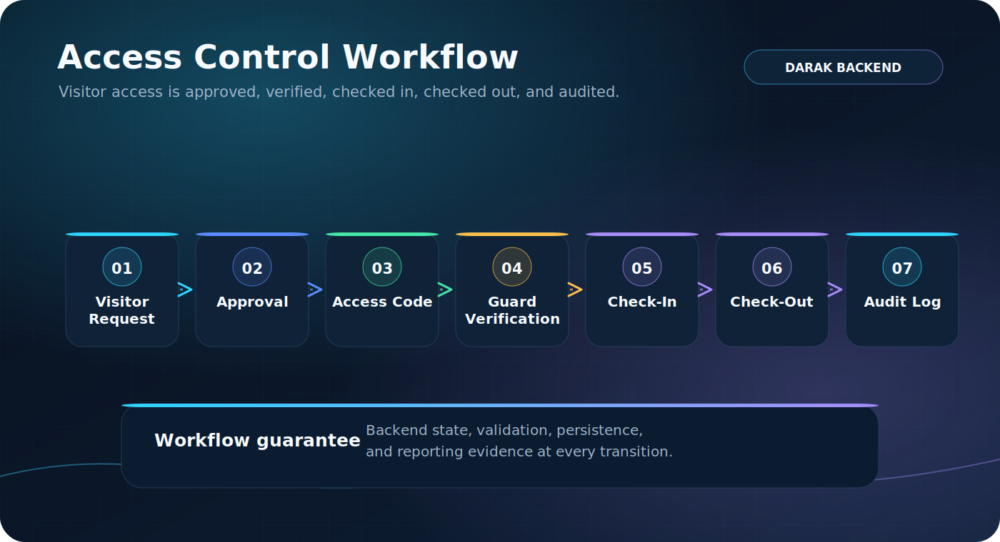
</p>

```text
Visitor Request -> Approval -> Access Code -> Guard Verification -> Check-In -> Check-Out -> Audit Log
```

Visitor and guard workflows are modeled with access-code verification, guard logs, check-in/check-out state, contractor access support, and audit-friendly records.

## Maintenance Workflow

<p align="center">
  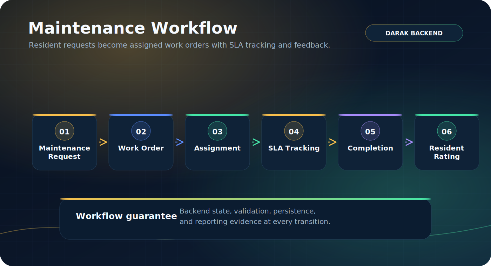
</p>

```text
Maintenance Request -> Work Order -> Assignment -> SLA Tracking -> Completion -> Resident Rating
```

Maintenance support covers resident requests, work orders, asset-oriented workflows, preventive maintenance, SLA tracking, staff assignment, and resident feedback.

## Procurement Workflow

<p align="center">
  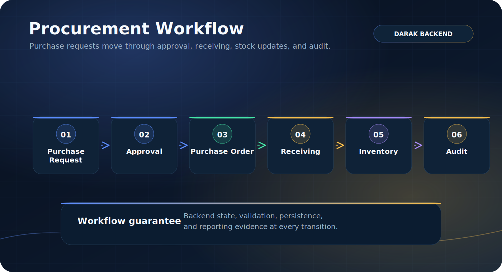
</p>

```text
Purchase Request -> Approval -> Purchase Order -> Receiving -> Inventory -> Audit
```

Procurement and inventory workflows support purchase requests, purchase orders, receipt handling, stock movement, vendor/staff operations, and audit evidence.

## Security Overview

<p align="center">
  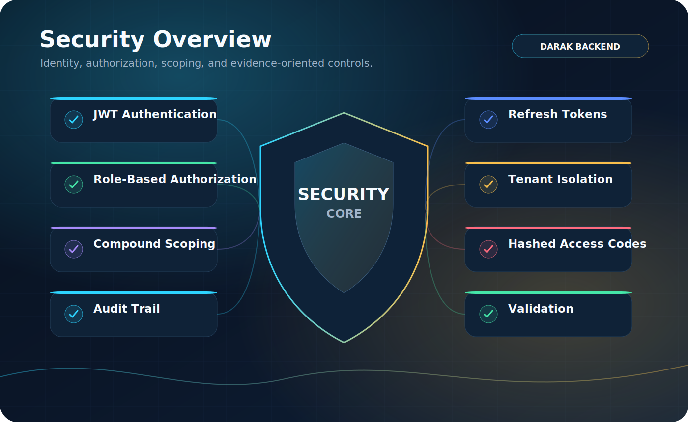
</p>

Security and governance capabilities include:

- JWT authentication and refresh-token workflows.
- Role-based authorization.
- Tenant isolation and compound scoping.
- Hashed access codes for visitor and contractor flows.
- Audit trail coverage.
- Validation and production startup safety checks.
- Environment-gated demo seed behavior.
- Development-only Swagger positioning.

## Testing & Quality

<p align="center">
  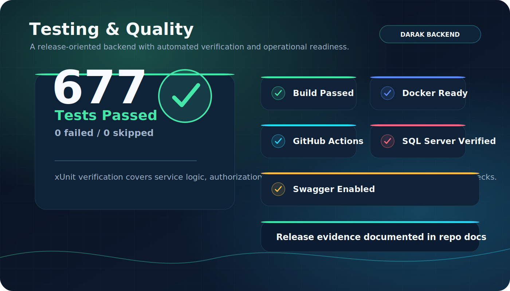
</p>

Recorded verification evidence includes:

- 677 xUnit tests passed.
- Release restore, build, and test gates.
- Docker readiness documentation.
- SQL Server migration and verification notes.
- GitHub Actions workflow support.
- Swagger/OpenAPI loading evidence.

Use [docs/Verification-Evidence.md](docs/Verification-Evidence.md) and [docs/Testing-Evidence.md](docs/Testing-Evidence.md) as the source of truth for recorded evidence.

## Swagger Screenshots

The screenshots below are real captures from the running local Swagger UI after verifying `/swagger/v1/swagger.json` returned HTTP 200.

| Swagger overview | Authentication endpoints |
|---|---|
|  |  |

| Admin modules | Resident endpoints |
|---|---|
|  |  |

| Guard access endpoints |
|---|
|  |

## Documentation

| Document | Purpose |
|---|---|
| [Verification Evidence](docs/Verification-Evidence.md) | Recorded restore, build, test, Swagger, Docker, and SQL Server evidence |
| [Testing Strategy](docs/Testing-Strategy.md) | Test coverage strategy and quality gates |
| [Security Notes](docs/Security-Notes.md) | Security model, configuration, and governance notes |
| [Tenant Isolation](docs/Tenant-Isolation.md) | Compound scoping and tenant boundary guidance |
| [Commercial Feature Matrix](docs/Commercial-Feature-Matrix.md) | Feature inventory for buyer or reviewer inspection |
| [Financial Model](docs/Financial-Model.md) | Billing, payment, receipt, and ledger model notes |
| [Guard Visitor Workflow Governance](docs/Guard-Visitor-Workflow-Governance.md) | Visitor and guard process governance |
| [Maintenance Reliability](docs/Maintenance-Reliability.md) | Maintenance and SLA reliability notes |
| [Procurement Inventory Governance](docs/Procurement-Inventory-Governance.md) | Procurement and inventory workflow notes |
| [Demo Seed Data](docs/Demo-Seed-Data.md) | Optional demo seed coverage and safety gates |
| [Deployment Runbook](docs/Deployment-Runbook.md) | Local and production-style deployment guidance |
| [Known Limitations](docs/Known-Limitations.md) | Honest limitations and non-claims |

## Getting Started

1. Install the .NET 10 SDK and Docker Desktop or SQL Server.
2. Copy the safe environment template:

```powershell
Copy-Item .\.env.example .\.env
```

3. Edit `.env` locally. Do not commit `.env`.
4. Start SQL Server:

```powershell
docker compose up -d sqlserver
```

5. Restore, build, migrate, and test:

```powershell
dotnet restore .\DARAK.sln
dotnet build .\DARAK.sln --configuration Release --no-restore
dotnet ef database update `
  --project .\DARAK.Api\DARAK.Api.csproj `
  --startup-project .\DARAK.Api\DARAK.Api.csproj
dotnet test .\DARAK.sln --configuration Release --no-build
```

6. Run the API:

```powershell
dotnet run --project .\DARAK.Api\DARAK.Api.csproj
```

Swagger/OpenAPI is available in Development when the API starts successfully.

## Repository Structure

```text
DARAK/
|-- DARAK.Api/                  # ASP.NET Core Web API
|-- DARAK.Tests/                # Unit, service, boundary, readiness, and optional SQL tests
|-- docs/                       # Verification, security, testing, diagrams, and handoff docs
|-- docs/assets/graphics/       # Premium GitHub README graphics
|-- docs/assets/screenshots/    # Real Swagger/API screenshots
|-- tools/                      # Cleanup, validation, release, and packaging scripts
|-- .github/workflows/          # GitHub Actions CI
|-- docker-compose.yml          # Local SQL/API compose setup
|-- docker-compose.production.yml
|-- .env.example                # Safe local template
|-- .env.production.example     # Safe production template
`-- DARAK.sln
```

## Known Limitations

DARAK is intentionally honest about what is and is not included:

- No admin, resident, guard, or mobile frontend is included.
- Real payment-provider settlement is not included.
- Real SMS/email provider credentials and production delivery operations are not included.
- Production hosting, backups, monitoring, incident response, and SLA operations are not included.
- Production-style claims require release-specific SQL Server migration and integration evidence.

See [docs/Known-Limitations.md](docs/Known-Limitations.md) for the full honesty ledger.

## GitHub Metadata Recommendation

Suggested repository About description:

```text
Backend-only ASP.NET Core residential compound management API with identity, tenant scoping, finance, visitors, maintenance, documents, notifications, tests, Docker, and CI.
```

Suggested topics:

```text
aspnet-core dotnet ef-core sql-server web-api backend property-management residential-compound xunit docker jwt swagger portfolio
```

## License

No license is currently declared. Add a license before public or commercial distribution.
