# DARAK — Residential Compound Management Backend

DARAK is a backend-only ASP.NET Core platform for residential compound operations: residents, units, billing, payments, visitors, guards, maintenance, procurement, documents, audit, reports, and notification workflows in one API-first codebase.


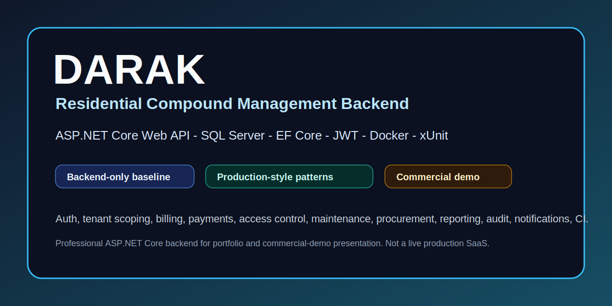

DARAK is intended as a serious backend portfolio and commercial-demo baseline. It is not presented as a complete live SaaS product: this repository does not include frontend/mobile clients, real payment settlement, real SMS/email provider setup, production hosting, or production operations ownership.

## Why DARAK Is Not a CRUD Toy Project

- It models a broad residential-compound domain instead of a single table workflow.
- It separates SuperAdmin, CompoundAdmin, Accountant, Guard, MaintenanceStaff, Staff, and Resident responsibilities.
- It uses compound scoping as a core design constraint for multi-compound access boundaries.
- It includes financial workflow foundations: utility bills, bill lines, payments, attempts, receipts, rent contracts, property sale installments, disputes, collections, and ledger entries.
- It includes operational workflows: visitor passes, guard logs, contractor permits, maintenance requests, work orders, vendors, staff, procurement, inventory, purchase orders, announcements, outages, approvals, documents, audit, reports, and notification outbox processing.
- It treats verification as part of the product: Release restore/build/test gates, SQL Server migration checks, optional SQL integration tests, CI, documentation, and 677+ xUnit tests.

## System Modules

| Area | What DARAK Covers |
|---|---|
| Identity and access | JWT login, refresh-token rotation, role boundaries, public registration control, first-SuperAdmin bootstrap |
| Compound structure | Compounds, buildings, floors, units, parking spots, compound assignment scope |
| Residents and occupancy | Resident profiles, family members, emergency contacts, occupancy lifecycle, move-out blockers |
| Finance | Bills, bill lines, payments, payment attempts, receipts, rent, sale installments, ledger entries, disputes, collections |
| Visitor and guard operations | Visitor passes, hashed access credentials, guard logs, contractor permits, contractor check-in evidence |
| Maintenance and assets | Maintenance requests, assets, work orders, preventive maintenance, SLA tracking |
| Staff, vendors, procurement | Staff/vendor assignment, inventory, stock movement, purchase orders, receipt idempotency |
| Communications | Announcements, utility outages, resident preferences, in-app notifications, notification outbox retry/backoff |
| Governance | Documents, document access logs, approvals, audit logs, saved reports, export jobs |
| Release hygiene | Docker Compose, SQL Server migrations, tests, CI, evidence docs, cleanup/package scripts |

## Visual Overview

### System Architecture

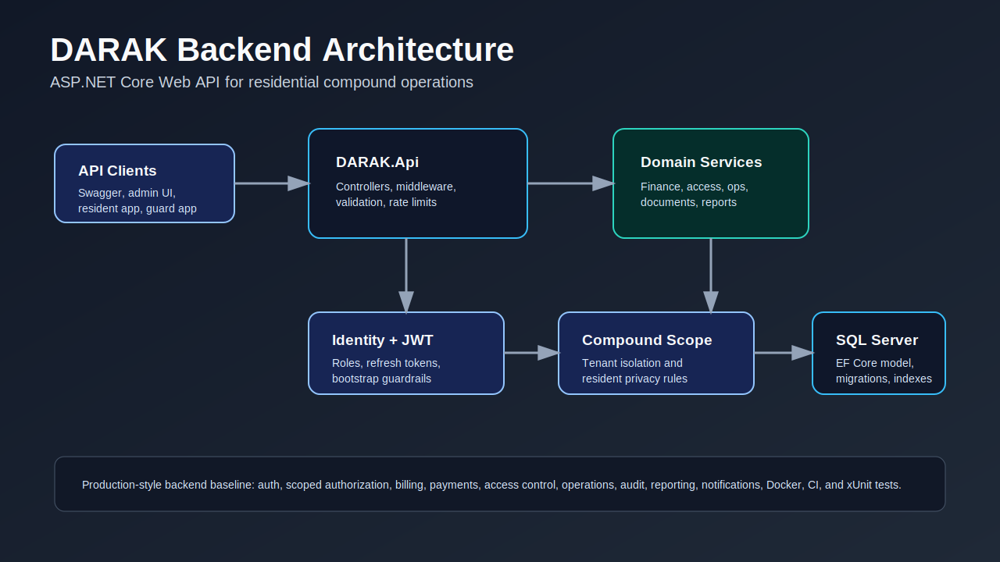

Shows the backend-first architecture: API clients call the ASP.NET Core Web API, domain services enforce business rules, and EF Core persists the compound model in SQL Server.

### Domain Modules

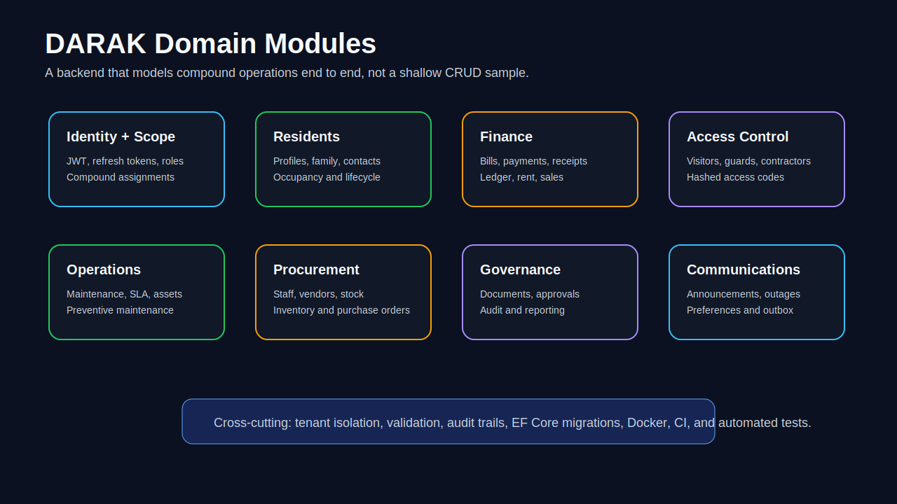

Shows the breadth of the domain beyond CRUD: residents, finance, access control, operations, communications, governance, and release hygiene are modeled as connected backend modules.

### Security Flow

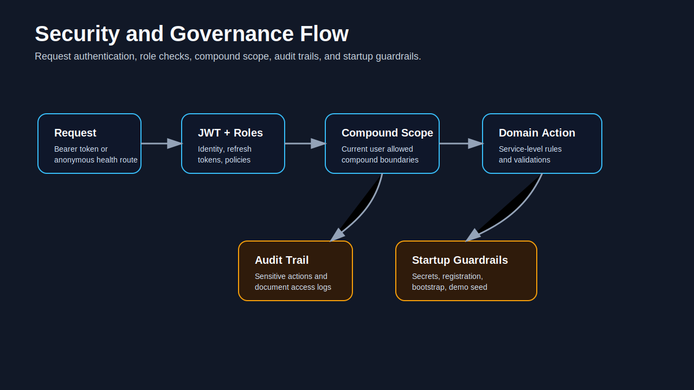

Shows how authentication, JWT validation, role checks, compound scoping, guarded bootstrap, and audit/report safety fit together.

### Financial Workflow

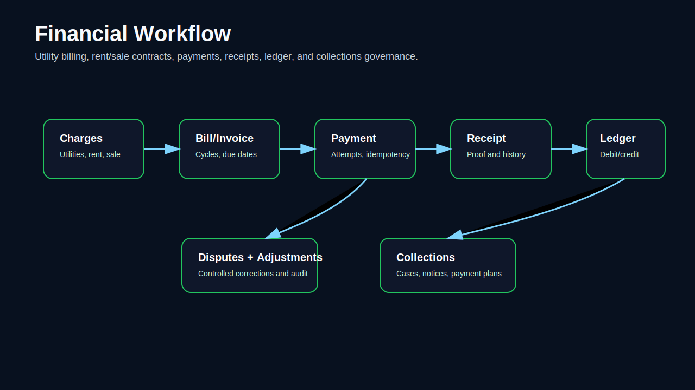

Shows the financial workflow foundations for bills, payment attempts, receipts, ledger entries, rent, sale installments, disputes, collections, and move-out clearance.

### Operations Workflow

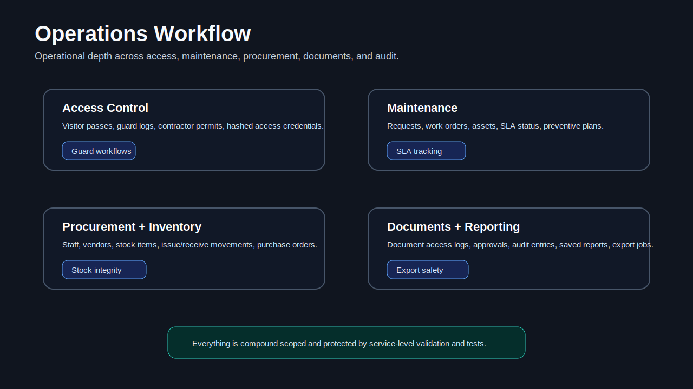

Shows the operational side of the system: visitor/guard flows, contractor access, maintenance, vendors, inventory, purchase orders, announcements, outages, documents, approvals, and reports.

### Testing And CI

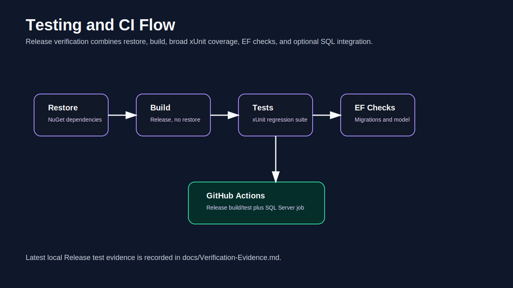

Shows how restore, build, tests, SQL Server migration checks, optional integration tests, CI, and release evidence support the backend presentation.

Source diagram files are kept in [docs/assets/diagrams](docs/assets/diagrams), with Mermaid equivalents documented in [docs/Architecture-Diagrams.md](docs/Architecture-Diagrams.md).

## Security And Governance

- JWT settings, issuer/audience, token lifetimes, and secrets are configuration-driven.
- Production startup validation rejects placeholder secrets and unsafe registration auto-confirm behavior.
- First-SuperAdmin bootstrap is disabled by default, guarded by explicit configuration, and refuses weak or placeholder credentials.
- Demo seed data is opt-in, environment-gated, idempotent, and refuses weak local demo passwords when user seeding is enabled.
- Visitor and contractor access values are stored as hashes and masked in normal responses.
- Report export completion stores sanitized filenames under the controlled export root and rejects traversal or absolute paths.
- Swagger is intended for Development only.

## Demo Seed Data

The optional demo seed creates a broad local dataset for portfolio review: compounds, users, residents, occupancies, finance records, visitor/guard records, maintenance and procurement data, announcements, outages, notifications, documents, reports, and audit entries.

The seed is disabled by default and guarded by environment checks. See [docs/Demo-Seed-Data.md](docs/Demo-Seed-Data.md).

## Verification Snapshot

Use [docs/Verification-Evidence.md](docs/Verification-Evidence.md) as the source of truth for recorded evidence. The current presentation pass is documentation/assets only; it does not require a migration.

Minimum local gate:

```powershell
dotnet restore .\DARAK.sln
dotnet build .\DARAK.sln --configuration Release --no-restore
dotnet test .\DARAK.sln --configuration Release --no-build
```

SQL Server migration gate:

```powershell
dotnet ef database update `
  --project .\DARAK.Api\DARAK.Api.csproj `
  --startup-project .\DARAK.Api\DARAK.Api.csproj

dotnet ef migrations has-pending-model-changes `
  --project .\DARAK.Api\DARAK.Api.csproj `
  --startup-project .\DARAK.Api\DARAK.Api.csproj
```

Optional SQL Server integration tests run when `DARAK_SQLSERVER_TEST_CONNECTION` or `ConnectionStrings__DefaultConnection` points to a reachable SQL Server instance.

## Run Locally

1. Install the .NET 10 SDK and Docker Desktop or SQL Server.
2. Copy the safe environment template:

```powershell
Copy-Item .\.env.example .\.env
```

3. Edit `.env` locally. Do not commit `.env`.
4. Start SQL Server:

```powershell
docker compose up -d sqlserver
```

5. Restore, build, migrate, and test:

```powershell
dotnet restore .\DARAK.sln
dotnet build .\DARAK.sln --configuration Release --no-restore
dotnet ef database update `
  --project .\DARAK.Api\DARAK.Api.csproj `
  --startup-project .\DARAK.Api\DARAK.Api.csproj
dotnet test .\DARAK.sln --configuration Release --no-build
```

6. Run the API:

```powershell
dotnet run --project .\DARAK.Api\DARAK.Api.csproj
```

## Docker And SQL Server

`docker-compose.yml` provides a local SQL Server/API-oriented setup. Keep local secrets in `.env` and use `.env.example` only as a safe template. Production-style deployment still needs real secret management, backups, monitoring, incident response, provider credentials, and release-specific SQL evidence.

## API Exploration And Swagger

Swagger/OpenAPI is available in Development when the API starts successfully. Swagger schema IDs use fully qualified DTO type names so same-named response models in different namespaces can coexist in the OpenAPI document.

The screenshots below are real captures from the running local Swagger UI after verifying `/swagger/v1/swagger.json` returned HTTP 200.

## Swagger / API Screenshots

### Swagger Overview

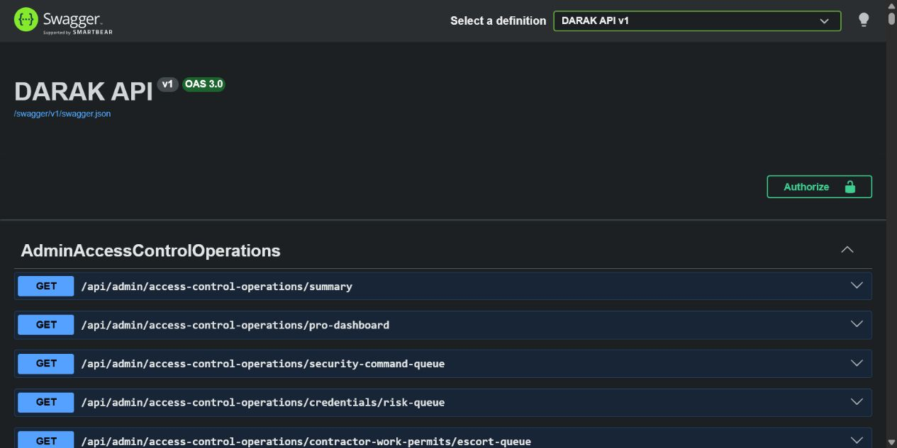

Proves the OpenAPI document loads successfully and exposes the backend as a developer-explorable API surface.

### Authentication Endpoints

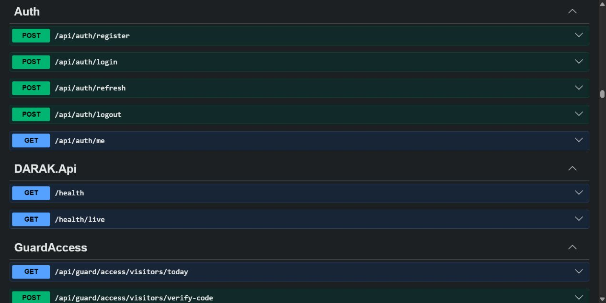

Proves the authentication surface is visible in Swagger, including registration, login, refresh, logout, and current-user endpoints.

### Admin Modules

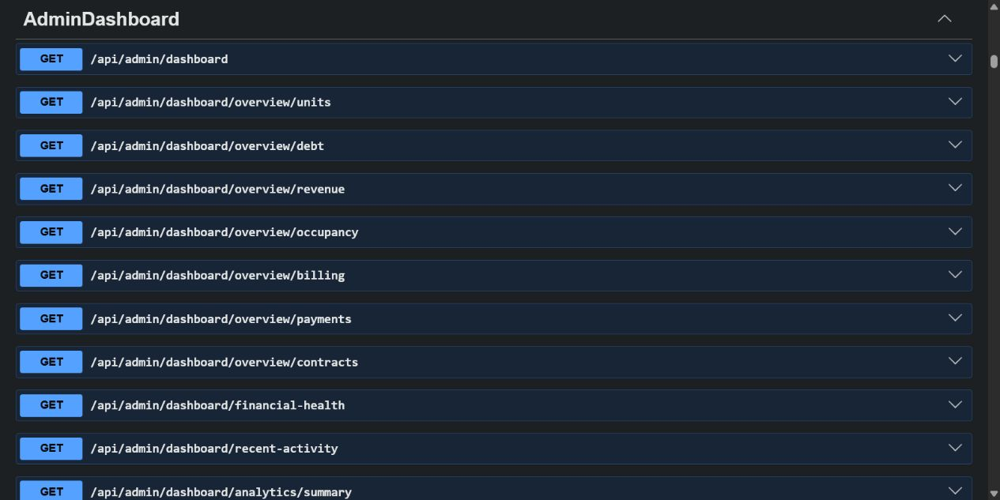

Proves the admin API includes operational dashboard endpoints for compound management and business review workflows.

### Resident Endpoints

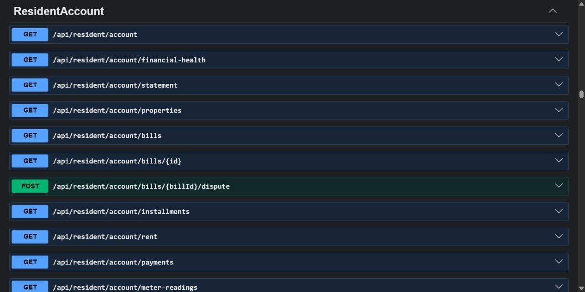

Proves resident-facing backend workflows are documented, including account, bills, disputes, installments, rent, payments, and meter-reading surfaces.

### Guard Access Endpoints

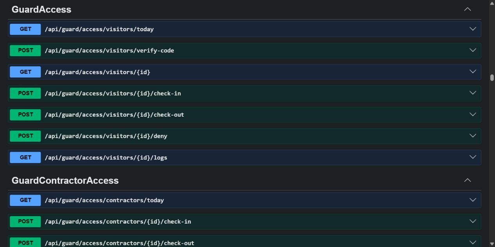

Proves guard and contractor access workflows are present in the API, including visitor verification, check-in/check-out, denial, logs, and contractor access.

## Demo Assets

- Social preview source: [docs/assets/social-preview/darak-social-preview.svg](docs/assets/social-preview/darak-social-preview.svg)
- Architecture diagrams: [docs/assets/diagrams](docs/assets/diagrams)
- Screenshot capture guide: [docs/Screenshot-Capture-Guide.md](docs/Screenshot-Capture-Guide.md)
- Screenshot folder policy: [docs/assets/screenshots/README.md](docs/assets/screenshots/README.md)

No placeholder or fake product screenshots are included.

## Repository Structure

```text
DARAK/
|-- DARAK.Api/                  # ASP.NET Core Web API
|-- DARAK.Tests/                # Unit, service, boundary, readiness, and optional SQL tests
|-- docs/                       # Verification, security, testing, diagrams, and handoff docs
|-- docs/assets/                # GitHub presentation diagrams and social preview assets
|-- tools/                      # Cleanup, validation, release, and packaging scripts
|-- .github/workflows/          # GitHub Actions CI
|-- docker-compose.yml          # Local SQL/API compose setup
|-- docker-compose.production.yml
|-- .env.example                # Safe local template
|-- .env.production.example     # Safe production template
`-- DARAK.sln
```

## Docs Map

- [Verification Evidence](docs/Verification-Evidence.md)
- [Testing Strategy](docs/Testing-Strategy.md)
- [Security Notes](docs/Security-Notes.md)
- [Known Limitations](docs/Known-Limitations.md)
- [Demo Seed Data](docs/Demo-Seed-Data.md)
- [Architecture Diagrams](docs/Architecture-Diagrams.md)
- [Environment Variables Reference](docs/Environment-Variables-Reference.md)
- [Screenshot Capture Guide](docs/Screenshot-Capture-Guide.md)
- [GitHub Profile Setup](docs/GitHub-Profile-Setup.md)
- [Interview Talking Points](docs/Interview-Talking-Points.md)
- [Deployment Runbook](docs/Deployment-Runbook.md)

## Known Limitations

- Backend only: no admin/resident/guard frontend and no mobile app are included.
- Real payment-provider settlement is not included.
- Real SMS/email provider credentials and production delivery operations are not included.
- Production hosting, backups, monitoring, incident response, and SLA operations are not included.
- Production-style claims require release-specific SQL Server migration and integration evidence.

See [docs/Known-Limitations.md](docs/Known-Limitations.md) for the full honesty ledger.

## Interview Talking Points

Good framing:

```text
DARAK is a large ASP.NET Core backend portfolio project for residential compound operations, with authentication, authorization boundaries, compound scoping, financial workflow foundations, operations workflows, document/audit/reporting workflows, tests, and release hygiene.
```

Avoid claiming it is a complete production SaaS until frontend clients, real provider integrations, production operations, and release-specific SQL evidence are completed and recorded.

## GitHub Metadata Recommendation

Suggested repository About description:

```text
Backend-only ASP.NET Core residential compound management API with identity, tenant scoping, finance, visitors, maintenance, documents, notifications, tests, Docker, and CI.
```

Suggested topics:

```text
aspnet-core dotnet ef-core sql-server web-api backend property-management residential-compound xunit docker jwt swagger portfolio
```

Suggested pinned caption:

```text
Residential compound management backend: auth, compound scoping, finance, visitor/guard operations, maintenance, documents, notifications, tests, Docker, and CI.
```

More setup notes are in [docs/GitHub-Profile-Setup.md](docs/GitHub-Profile-Setup.md).

## GitHub Hygiene

Before publishing or packaging:

```powershell
.\tools\Clean-BeforeGitHub.ps1
```

Generated files such as `bin/`, `obj/`, logs, `TestResults/`, coverage output, uploads, exports, backup folders, `.env`, and ZIP files are ignored and should not be committed.

## Historical Markers

The repository keeps historical phase markers used by regression tests and handoff scripts. These are not a substitute for fresh verification evidence.

- Phase 9 - Final Commercial Completion Pack
  - No migration is required for Phase 9.
  - Gate script: `tools/Test-FinalReleaseGate.ps1`.
- Phase 23 - Final Commercial Review & Hardening Pass
  - Gate script: `tools/Test-CommercialReadiness.ps1`.
  - Package script: `tools/New-CommercialReleasePackage.ps1`.
  - Migration required: none.

## License

No license is currently declared. Add a license before public or commercial distribution.
