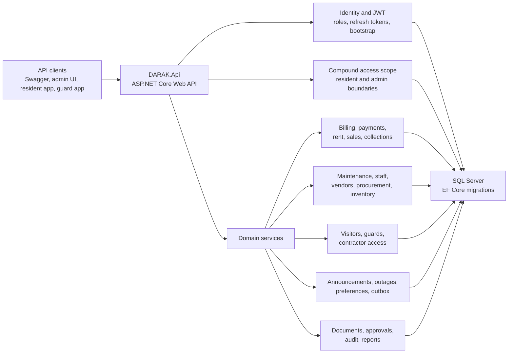
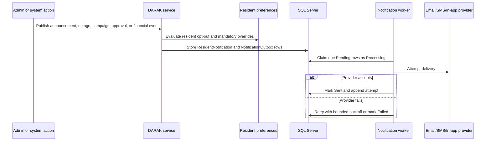
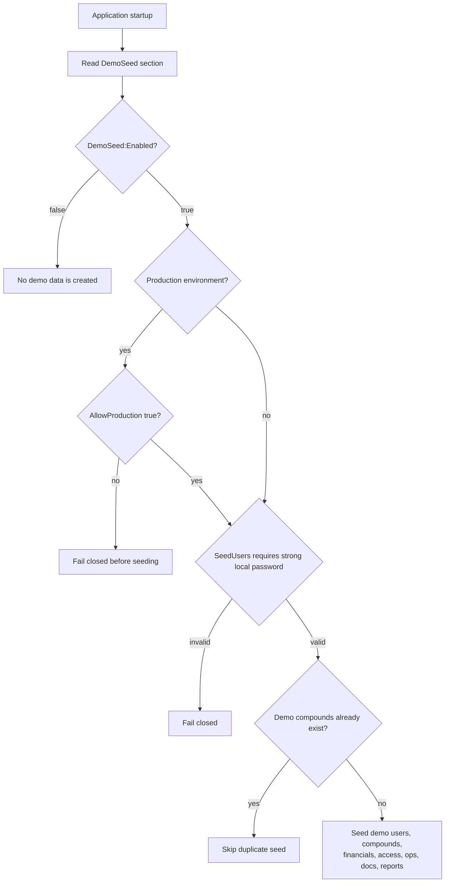

# DARAK Backend Architecture Diagrams

These diagrams are source-controlled Mermaid diagrams. They are not screenshots.

## Backend Module Map

## Notification Outbox Flow

## Demo Seed Guardrail

