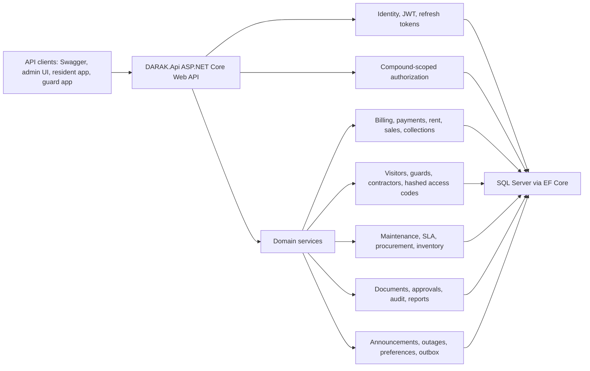

# Architecture Overview

```mermaid
flowchart LR
    Clients["API clients: Swagger, admin UI, resident app, guard app"] --> Api["DARAK.Api ASP.NET Core Web API"]
    Api --> Identity["Identity, JWT, refresh tokens"]
    Api --> Scope["Compound-scoped authorization"]
    Api --> Services["Domain services"]
    Services --> Finance["Billing, payments, rent, sales, collections"]
    Services --> Access["Visitors, guards, contractors, hashed access codes"]
    Services --> Ops["Maintenance, SLA, procurement, inventory"]
    Services --> Gov["Documents, approvals, audit, reports"]
    Services --> Comms["Announcements, outages, preferences, outbox"]
    Identity --> Db["SQL Server via EF Core"]
    Scope --> Db
    Finance --> Db
    Access --> Db
    Ops --> Db
    Gov --> Db
    Comms --> Db
```

