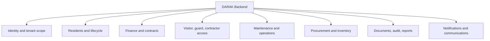

# Domain Modules

```mermaid
flowchart TB
    Core["DARAK Backend"]
    Core --> Identity["Identity and tenant scope"]
    Core --> Residents["Residents and lifecycle"]
    Core --> Finance["Finance and contracts"]
    Core --> Access["Visitor, guard, contractor access"]
    Core --> Operations["Maintenance and operations"]
    Core --> Procurement["Procurement and inventory"]
    Core --> Governance["Documents, audit, reports"]
    Core --> Comms["Notifications and communications"]
```

