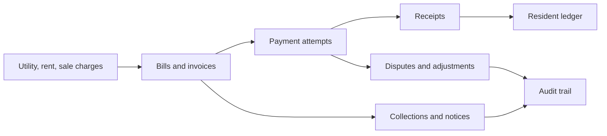

# Financial Flow

```mermaid
flowchart LR
    Charges["Utility, rent, sale charges"] --> Bills["Bills and invoices"]
    Bills --> Payments["Payment attempts"]
    Payments --> Receipts["Receipts"]
    Receipts --> Ledger["Resident ledger"]
    Bills --> Collections["Collections and notices"]
    Payments --> Disputes["Disputes and adjustments"]
    Disputes --> Audit["Audit trail"]
    Collections --> Audit
```

