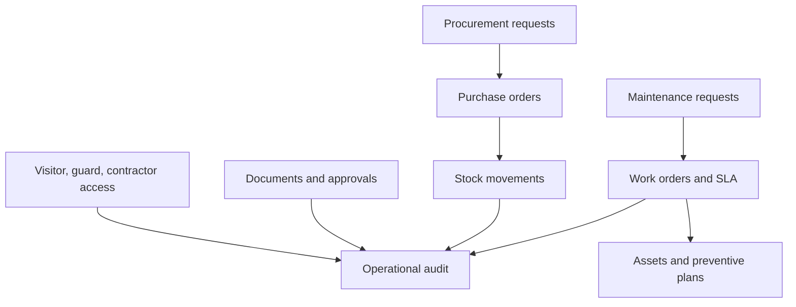

# Operations Flow

```mermaid
flowchart TB
    Access["Visitor, guard, contractor access"] --> Audit["Operational audit"]
    Maintenance["Maintenance requests"] --> WorkOrders["Work orders and SLA"]
    WorkOrders --> Assets["Assets and preventive plans"]
    Procurement["Procurement requests"] --> PurchaseOrders["Purchase orders"]
    PurchaseOrders --> Inventory["Stock movements"]
    Documents["Documents and approvals"] --> Audit
    Inventory --> Audit
    WorkOrders --> Audit
```

