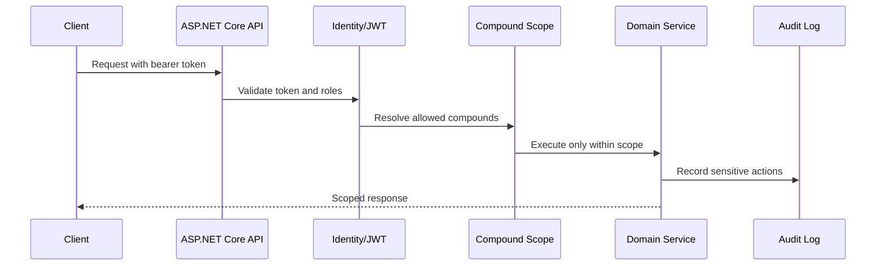

# Security Flow

```mermaid
sequenceDiagram
    participant Client
    participant Api as ASP.NET Core API
    participant Auth as Identity/JWT
    participant Scope as Compound Scope
    participant Service as Domain Service
    participant Audit as Audit Log

    Client->>Api: Request with bearer token
    Api->>Auth: Validate token and roles
    Auth->>Scope: Resolve allowed compounds
    Scope->>Service: Execute only within scope
    Service->>Audit: Record sensitive actions
    Service-->>Client: Scoped response
```

