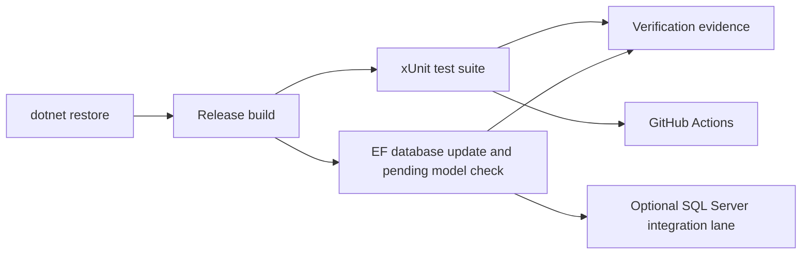

# Testing And CI Flow

```mermaid
flowchart LR
    Restore["dotnet restore"] --> Build["Release build"]
    Build --> Tests["xUnit test suite"]
    Tests --> Evidence["Verification evidence"]
    Build --> Ef["EF database update and pending model check"]
    Ef --> Evidence
    Tests --> Ci["GitHub Actions"]
    Ef --> CiSql["Optional SQL Server integration lane"]
```

